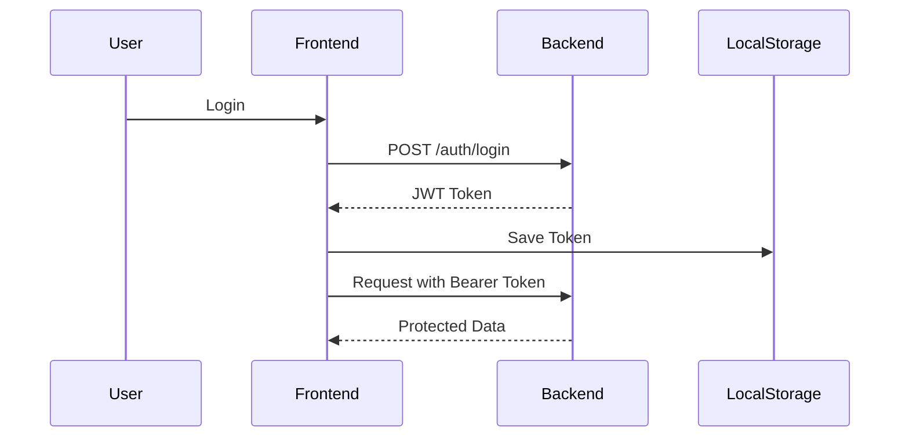
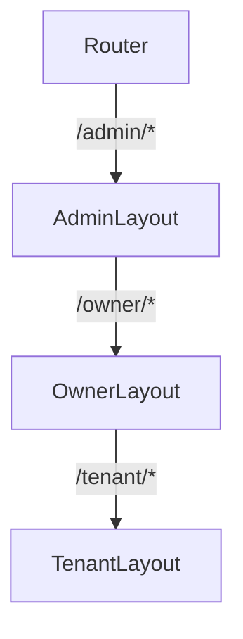
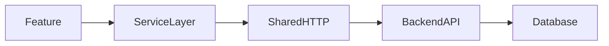

# 🏢 RentSphere Frontend  
> Condominium & Apartment Management System (Admin / Owner / Tenant)

Frontend สำหรับระบบจัดการคอนโด/หอพัก **RentSphere** พัฒนาด้วย **React + TypeScript + Vite**  
เชื่อมต่อ **Backend ผ่าน REST API** และใช้ **JWT Authentication**

---

## 📌 Project Overview

RentSphere รองรับการใช้งาน 3 บทบาทหลัก:

- 👨‍💼 **Admin** — ผู้ดูแลระบบกลาง  
- 🏢 **Owner** — เจ้าของคอนโด/หอพัก  
- 🧑‍💻 **Tenant** — ผู้เช่า  

---

## 🛠 Tech Stack

- React 19  
- TypeScript  
- Vite  
- React Router  
- Zustand (State Management)  
- Tailwind CSS  
- Recharts  
- react-hot-toast  
- lucide-react  

---

# ⚙️ ติดตั้งและรันโปรเจกต์แบบละเอียด (Local Setup)

> เป้าหมาย: เปิดหน้าเว็บได้ที่ `http://localhost:5173` และยิง API ไป backend ได้ถูกต้อง

## 0) เตรียมของที่ต้องมี (Prerequisites)

### A) ติดตั้ง Node.js (แนะนำ 18+ หรือ 20+)
- ตรวจสอบเวอร์ชัน:
```bash
node -v
npm -v
```
ถ้ายังไม่มี ให้ติดตั้ง Node.js LTS จากเว็บทางการ

### B) Git (สำหรับ clone โค้ด)
- ตรวจสอบ:
```bash
git --version
```

### C) แนะนำให้ใช้ VS Code + Extensions
- **ESLint**
- **Prettier**
- (ถ้าอยากดู Diagram Mermaid ใน VS Code) **Markdown Preview Mermaid Support**

> หมายเหตุ: Diagram แบบ Mermaid “บางที่ไม่แสดง” ใน preview ปกติของ VS Code ถ้าไม่ลง extension

---

## 1) เปิดโปรเจกต์

ถ้าเป็น zip:
1. แตกไฟล์ zip
2. เข้าโฟลเดอร์ `rentsphere` (อันที่มี `package.json`)

โครงสร้างโดยรวมจะประมาณนี้:
```bash
rentsphere/
  package.json
  vite.config.ts
  src/
  public/
```

---

## 2) ติดตั้ง Dependencies

เปิด Terminal ที่โฟลเดอร์ `rentsphere/` แล้วรัน:
```bash
npm install

ถ้าอยากติดตั้งเองทีละตัว (กรณีสร้างโปรเจกต์ใหม่)
สร้างโปรเจกต์ใหม่ด้วย Vite
npm create vite@latest rentsphere -- --template react-ts

cd rentsphere
npm install
แล้ว install เพิ่มเอง
npm install react-router-dom zustand recharts react-hot-toast lucide-react
npm install -D tailwindcss @tailwindcss/vite

```

ถ้าติด error แปลก ๆ ให้ลอง:
```bash
rm -rf node_modules package-lock.json
npm install
```

---

## 3) ตั้งค่า Environment (.env.local)

สร้างไฟล์ชื่อ **`.env.local`** ในโฟลเดอร์ `rentsphere/` (ระดับเดียวกับ package.json)

ตัวอย่าง:
```env
VITE_API_URL=http://localhost:3000/api/v1
```

✅ ถ้า backend รันที่เครื่องเรา ส่วนใหญ่จะเป็น:
- Backend: `http://localhost:3000`
- API Base: `http://localhost:3000/api/v1`
- Frontend: `http://localhost:5173`

> ถ้า backend deploy ไว้ (Render/โดเมนอื่น) ให้เปลี่ยนเป็น URL จริง เช่น  
> `VITE_API_URL=https://your-backend-domain/api/v1`

---

## 4) รันโปรเจกต์ (Dev Mode)

```bash
npm run dev
```

เปิดเว็บ:
- `http://localhost:5173`

---

## 5) เชื่อมต่อ Backend 

### A) API Client อยู่ที่ไหน?
Frontend เรียก API ผ่านไฟล์:
- `src/shared/api/http.ts`

มันจะ:
- อ่าน token จาก `localStorage` key: `rentsphere_auth`
- ใส่ header `Authorization: Bearer <token>` ให้อัตโนมัติ
- ตั้ง `Content-Type: application/json` (ยกเว้นส่ง FormData)

### B) ทดสอบว่าเชื่อม backend ได้ไหม
1) เปิด DevTools > Network  
2) ลอง login แล้วดู request ไป backend  
3) ถ้าได้ `200` หรือ `201` แปลว่าเชื่อมได้

### C) ถ้าเจอ CORS Error
เป็นปัญหาที่ backend ต้อง allow origin ของ frontend เช่น:
- `http://localhost:5173`
- หรือโดเมน Vercel ที่ deploy frontend

---

## 6) คำสั่งสำคัญที่ใช้บ่อย

```bash
npm run dev       # รัน dev server
npm run build     # build production
npm run preview   # preview build ในเครื่อง
npm run lint      # ตรวจ eslint
```

---

# 🏗 RentSphere Frontend Architecture 

## ✅ แนวคิดสถาปัตยกรรม (Architecture Concept)

โปรเจกต์นี้ใช้แนวคิดหลัก:

- **Feature-Based Modular Architecture**  
  แยกโค้ดตาม business domain (admin/auth/owner/tenant) เพื่อ scale ได้ง่าย

- **Role-Based Routing & Layout Separation**  
  แยกหน้าและ layout ตามบทบาทผู้ใช้ ช่วยให้ควบคุมสิทธิ์และ UX ชัดเจน

- **Centralized HTTP Layer**  
  รวม logic การเรียก API, ใส่ token, และ handle error ไว้ที่เดียว

---

## 📂 Core Project Structure

```bash
src/
 ├── app/                # Routing + Layout control
 │   ├── layouts/
 │   └── router/
 │
 ├── features/           # Business Domains
 │   ├── admin/          # Admin System
 │   ├── auth/           # Authentication
 │   ├── owner/          # Owner System
 │   └── tenant/         # Tenant System
 │
 ├── shared/             # Shared Modules
 │   ├── api/            # HTTP abstraction
 │   ├── components/     # Shared components
 │   └── layouts/        # Shared layouts
 │
 ├── assets/             # Static assets
 ├── App.tsx             # Root Component
 ├── main.tsx            # Entry Point
 └── types.ts            # Global Types
```

---

## 🧩 Feature Module Pattern

แต่ละ feature โดยทั่วไปจะแบ่งเป็น:

```bash
feature/
 ├── pages/          # หน้าระดับ route
 ├── components/     # component เฉพาะของ feature
 ├── hooks/          # custom hooks
 ├── services/       # เรียก API
 ├── types/          # type เฉพาะ feature
 └── store.ts        # Zustand store (ถ้ามี)
```

---

## 🔐 Authentication Flow

1) ผู้ใช้กรอกข้อมูล login บน Frontend  
2) Frontend ส่ง `POST /auth/login` ไป Backend  
3) Backend ตอบกลับ `JWT token`  
4) Frontend เก็บ token ใน `localStorage (rentsphere_auth)`  
5) ทุก request ถัดไป Frontend จะแนบ `Authorization: Bearer <token>` อัตโนมัติผ่าน `shared/api/http.ts`

---

## 🏢 Role-Based Layout Separation 

- `/admin/*` → ใช้ Admin Layout + Admin Pages
- `/owner/*` → ใช้ Owner Layout + Owner Pages
- `/tenant/*` → ใช้ Tenant Layout + Tenant Pages

ข้อดี:
- UI ไม่ปนกัน
- สิทธิ์ (permission) จัดการง่าย
- เพิ่ม role ใหม่ในอนาคตง่าย

---

## 🌐 API Communication Layer

ลำดับการเรียก API โดยทั่วไป:
1) Page/Component เรียก service ของ feature  
2) service ใช้ `shared/api/http.ts` ยิง request ไป backend  
3) backend ตอบกลับเป็น JSON  
4) นำ data ไปแสดงผล

---

## 📌 Diagram (Mermaid)

> ถ้า “รูปไม่ขึ้น” ใน GitHub/VSCode:  
> - GitHub แสดง Mermaid ได้ในหลายกรณี (แต่บางที่/บาง preview ไม่แสดง)  
> - VS Code ต้องลง extension: **Markdown Preview Mermaid Support**

### 1) Auth Sequence Diagram


### 2) Role-Based Routing


### 3) API Flow


---

# 🧪 Troubleshooting (เจอบ่อย)

### 1) API ยิงไม่ได้ / 401
- เช็ค `VITE_API_URL` ถูกไหม
- เช็ค backend รันอยู่ไหม
- เช็ค token ใน localStorage (key: `rentsphere_auth`)

### 2) CORS Error
- ต้องแก้ที่ backend ให้ allow origin ของ frontend

### 3) เปลี่ยน `.env.local` แล้วไม่อัปเดต
- ปิด dev server แล้วเปิดใหม่:
```bash
Ctrl+C
npm run dev
```

### 4) เปิดโปรเจกต์แล้วขึ้น error แปลก ๆ
- ลองลบและติดตั้งใหม่:
```bash
rm -rf node_modules package-lock.json
npm install
```

---


# 📚 Academic Summary 

โปรเจกต์นี้แสดงให้เห็นถึง:
- การออกแบบ Frontend แบบ Modular (Feature-based)
- การแยก UI และ Route ตาม Role (Admin/Owner/Tenant)
- การเชื่อมต่อ API ผ่าน HTTP abstraction layer
- การยืนยันตัวตนด้วย JWT และการจัดการ token ฝั่ง client
- โครงสร้างที่รองรับการขยายระบบและการทำงานร่วมกันเป็นทีม

---

© RentSphere Project
